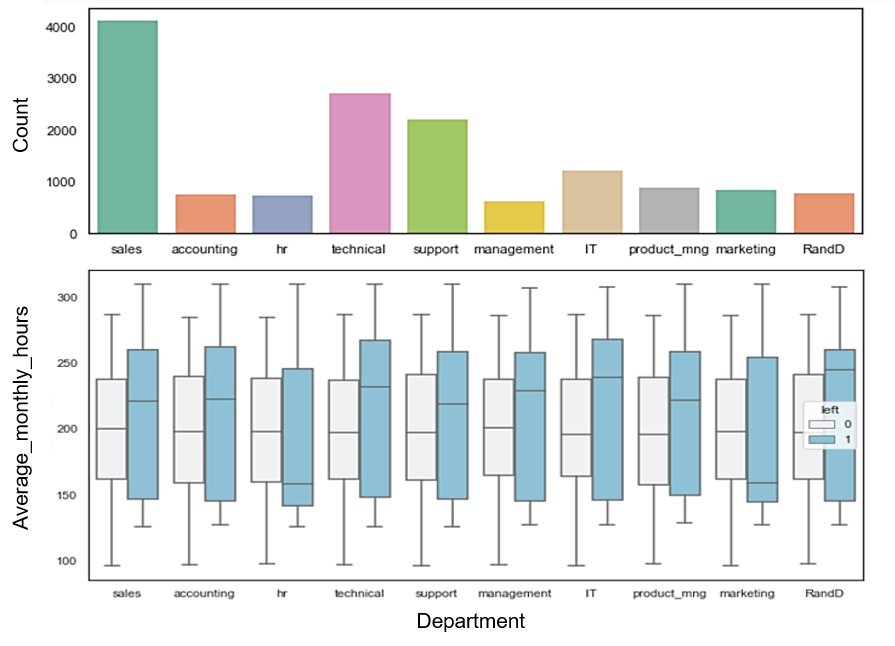

# PREDICTING EMPLOYEE LEAVING 

Rawan Alamoud

## ABSTRACT
The purpose of this project is to build a classification model that helps the organization predict whether the employee will leave the organization or continue to work for it. I worked with a human resources dataset provided by Kaggle website. First, I started to explore the dataset, then I used Matplotlib and Seaborn tools to visualize the data to help identify the features that led the employees to leave, after that I used Logistic regression and k-nearest neighbors model to predict the employees from the test set that are most likely to leave and then I evaluated each model.

## DESIGN
This project helps to figure out which feature has a direct and clear impact on employee leaving and predict whether an employee with a specific profile may leave or not, in order to provide the necessary support to retain the employees and minimize the negative impact on the organization.

## DATA
The dataset contains 14,999 data points with 10 features. The features I am using, such as department, number of years the employee has worked in the organization, promotions, relative level of salary, satisfaction level etc. two features are categorical, and the remaining features are of integer and float. 

## ALGORITHMS
*Feature Engineering*

Converting categorical features into numerical features. 

*Models* 

I used Logistic regression and k-nearest neighbors classifiers.

*Model Evaluation and Selection* 

The entire dataset of 14,999 records was split into 80/20 train vs. test. Below is the evaluation of each model. 
   
**Logistic regression**
- Accuracy: 0.758  
- MSE: 0.242
- F1: 0.85 contracted, 0.31 left
- Precision: 0.79 contracted, 0.47 left
- Recall: 0.92 contracted, 0.23 left

**KNN**
- Accuracy: 0.9273  
- MSE: 0.072
- F1: 0.95 contracted, 0.85 left
- Precision: 0.97 contracted, 0.81 left
- Recall: 0.94 contracted, 0.90 left	

## TOOLS
- Numpy and Pandas for data processing
- Scikit-learn for modeling
- Matplotlib and Seaborn for visualization

## COMMUNICATION 

Presentation that includes visuals for communicating the objectives and findings.

